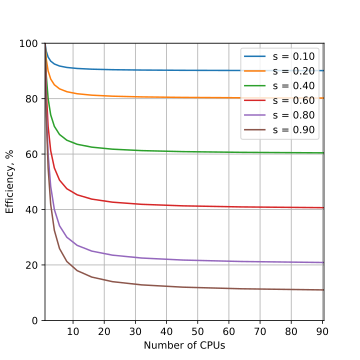
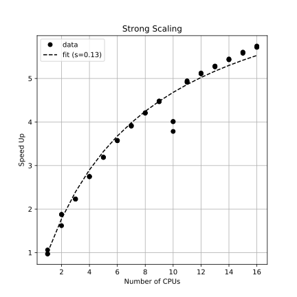

#### Speedup
Parallel **speedup** is defined as the ratio of the serial runtime of the best
sequential algorithm to the time taken by the parallel algorithm to solve the
same problem on $N$ processors:

$$ Speedup = \frac{T_s}{T_p}$$

...where $T_s$ is sequential runtime and $T_p$ is parallel runtime.  Serial
runtime is (usually!) longer than parallel runtime, so a larger speedup is
better.

Optimally, the speedup from parallelization would be linear. Doubling the number of processing elements should halve the runtime, and doubling it a second time should again halve the runtime.  That would mean that every processor would be contributing 100% of its computational power. However, very few parallel algorithms achieve optimal speedup. Most of them have a near-linear speedup for small numbers of processing elements, which flattens out into a constant value for large numbers of processing elements.

#### Efficiency

**Efficiency** is the ratio between the actual speedup and the ideal speedup
obtained when using a certain number of processors. We just argued that the
ideal speedup is proportional to the number of processors, $N$, so:

$$Efficiency=\frac{Speedup}{N}=\frac{T_s}{T_p*N}$$

Efficiency can be also understood as the fraction of time for which the
processors are doing useful work, or the fraction of the processors 
which are doing useful work on average.

- 0-100%
- Depends on the number of processors
- Varies with the size of the problem

When writing a parallel application we want processors to be used efficiently.

#### Amdahl's law

We can think of a program or algorithm as having *parallelizable* and
*non-parallelizable* parts.  Parallelizable parts are those segments of the
code that can execute on separate processors doing separate work.
Non-parallelizable parts are those segments of the code which can only be done
by one process, or equivalently, parts which do duplicate work if executed by
more than one process.  

Reading in a parameter which every process must have, for example, is a
non-parallelizable operation.  You can either have one process read, or you can
have all processes read, but since all processes would be doing exactly the
same work, no speed advantage would be gained by parallelizing the operation.
Therefore input is a *non-parallelizable* part of most programs.

Amdahl's Law takes this division of code into parallelizable and non-parallelizable
parts to describe the maximum speedup of an algorithm.

Express the time to run the serial code as the sum of the time to run the
parallelizable *fraction*, $P$, and the time to run the non-parallelizable
*fraction*, $S$ (for serial):

$$T_s = T_s S + T_s P;    S+P=1$$

The time to run the parallel code is reduced by the number of processors $N$,
but only for the parallelizable part.  Furthermore, the parallel program may
have to do certain operations that the serial code does not.  These operations
might include, for example, setting up communications with other processes,
or waiting for other processes to complete so that shared memory is consistent.
We encapsulate these extra operations as *parallel overhead*, $K$:

$$T_p = T_s S + T_s \frac{P}{N} + K$$

If we make the extremely optimistic assumption that $K$ is negligibly small
and substitute the above into the definition of speedup, we get:

$$ Speedup = \frac{T_s}{T_p} = \frac{1}{S+\frac{P}{N}} $$

This equation is known as **Amdahl's law**. It states that the speedup of a
program from parallelization is limited by the fraction of the program that can
be parallelized.

For example, if 50% of the program can be parallelized, the maximum speedup using parallel computing would be 2 no matter how many processors are used.

| Speed Up| Efficiency |
:---:|:---:
| | |

Amdahl's law highlights that no matter how fast we make the parallel part of
the code, we will always be limited by the serial portion.  Furthermore,
if the parallel overhead $K$ is not actually small, that's even worse news.
It is entirely possible for the run time of a parallel program to be *worse*
than the run time of the equivalent serial program due to $K$.

This suggests that parallel computing is only useful when the number of
processors is small, or when the problem is perfectly parallel, i.e.,
embarrassingly parallel. Amdahl's law is a major obstacle in boosting parallel
performance.

But notice that Amdahl's law assumes that the total amount of work is
*independent of the number of processors*, that is, the problem is the same
size no matter how many processors we use.  This type of scaling is referred to
as *Strong Scaling*.

#### Gustafson's law

It is very common, however, that we have some control over the size of our
problem, and we are using parallel computing to handle larger problems than we
can in serial.  For example, we might be doing some simulation on a grid where
we can choose how fine to make the grid.  Increasing the number of points on
the grid increases (we hope) the precision of our results, but also requires
more computing.

This scenario is called *Weak Scaling*:

If we can arrange that the total amount of work to be done in parallel varies
*linearly* with the number of processors, speedup will be given by **Gustafson's
law**, shown here without derivation:

$$\large{Speedup = N − S * (N − 1)}$$

where $N$ is the number of processors and $S$ is the serial fraction as before.
(We also continue to assume that the parallel overhead $K$ is negligible.)

| Speed Up| Efficiency |
:---:|:---:
||

The theoretical speedup is more optimistic in this case. We can see that any sufficiently large problem can be solved in the same amount of time by using more processors. We can use larger systems with more processors to solve larger problems.

#### Example problem with weak scaling.

Imagine that you are working on a numeric weather forecast for some country. To
predict the weather, you need to divide the whole area into many small cells
and run the simulation. Let's imagine that you divided the whole area into
10,000 cells with a size of 50x50 km and simulation of one week forecast took 1
day on 1 CPU. You want to improve forecast accuracy to 10 km. In this case, you
would have 25 times more cells. The volume of computations would increase
proportionally and you would need 25 days to complete forecast. This is
unacceptable and you increase the number of CPUs to 25 hoping to complete the
job in 1 day. Gustafson's Law says you have some reasonable hope of it working.

#### Example problem with strong scaling.

Imagine that you want to analyze customer transactional data for 2019. You
cannot add more transactions to your analysis because there was no more.  This
is fixed-size problem and it will follow strong scaling (Amdahl's) law.

Any real-life problem falls in one of these 2 categories, although it is not
always practical to maintain a precise linear proportion between problem size
and number of processors. The type of scaling is a property of a problem that
cannot be changed, but understanding what kind of scaling to expect helps us
make sensible choices about the number of processing elements so that
we use them efficiently.

> ## Measuring Parallel Scaling
>
>It is important to measure the parallel scaling of your problem before running long production jobs.
>
> - To test for strong scaling we measure how the wall time of the job scales with the number of processing elements (openMP threads or MPI processes).
> - To test for weak scaling we increase both the job size and the number of processing elements.
> - The results from these tests allow us to determine the optimal amount of CPUs for a job.
{: .callout}

#### Example problem.

The example OpenMP program calculates an image of a [Julia set](https://people.sc.fsu.edu/~jburkardt/c_src/julia_set/julia_set.html). It is written by [John Burkardt](https://people.sc.fsu.edu/~jburkardt/) and released under the GNU LGPL license.

The program is modified to take width, height and number of threads as arguments. It will print the number of threads used and computation time on screen. It will also append these numbers into the file 'output.csv' for analysis. You could repeat each computation several times to improve accuracy.

The algorithm finds a set of points in a 2D rectangular
domain with width W and height H that are associated with Julia set.

The idea behind Julia set is choosing two complex numbers $z_0$ and $c$, and then repeatedly evaluating

 $$z_{n+1}=z_{n}^2+c$$

For each complex constant $c$ one gets a different Julia set. The initial value $z_0$ for the series is each point in the image plane.

To construct the image each pixel (x,y) is mapped to a rectangular region of the complex plane:  $z_0=x+iy$. Each pixel then represents the starting point for the series, $z_0$. The series is computed for each pixel and if it diverges to infinity it is drawn in white, if it doesn't then it is drawn in red.

In this implementation of the algorithm up to the maximum of 200 iterations for each point, $z$ is carried out. If the value of $\lvert z \lvert$ exceeds 1000 at any iteration, $z$ is not in the Julia set.

> ## Running strong and weak scaling tests
> We can run this sample program in both strong and weak scaling modes.
> - To test the strong scaling run the program with fixed size (width=2000, height=2000) and different numbers of threads (1-16).
>
> - To measure weak scaling we run the code with different numbers of threads and with a correspondingly scaled width and height.
>
>Once the runs are completed we fit the strong and weak scaling results with  Amdahl’s and Gustafson’s equations to obtain the ratio of the serial part (s) and the parallel part (p).
{: .callout}

#### Compiling and Running the Example

1. Download and unpack the code:
    ~~~
    wget https://acenet-arc.github.io/ACENET_Summer_School_General/code/julia_set.tar
    tar -xf julia_set.tar
    cd scaling
    ~~~
    {: .source}

1. Compile the program *julia_set_openmp.c*
    ~~~
    gcc -fopenmp julia_set_openmp.c
    ~~~
    {: .source}

2. Run on 2 CPUs
    ~~~
    ./a.out 2000 2000 2
    ~~~
    {: .source}
    ~~~
    JULIA_OPENMP:
      C/OpenMP version.
      Plot a version of the Julia set for Z(k+1)=Z(k)^2-0.8+0.156i
      Using 2 threads max, 0.195356 seconds

    TGA_WRITE:
      Graphics data saved as 'julia_openmp.tga'

    JULIA_OPENMP:
      Normal end of execution.
    ~~~
    {: .output}

    The program generates image file *julia_openmp.tga*:
    

    The program also writes the thread count and run time to a file *output.csv*.
    Delete or rename *output.csv* so that you have a clean dataset for the next step.

3. To measure strong scaling submit array job: *sbatch submit_strong.sh*
    ~~~
    #!/bin/bash
    #SBATCH -A def-sponsor0
    #SBATCH --cpus-per-task=16
    #SBATCH --time=1:0
    #SBATCH --array=1-16%1 # Run 16 jobs, one job at a time

    # Run the code 3 times to get some statistics
    ./a.out 2000 2000 $SLURM_ARRAY_TASK_ID
    ./a.out 2000 2000 $SLURM_ARRAY_TASK_ID
    ./a.out 2000 2000 $SLURM_ARRAY_TASK_ID
    ~~~
    {: .source}

4. Fit the data with Amdahl's law.
   The python script will estimate the serial fraction $S$, and try to plot a graph of the fitted curve.
   (To see the graph you may need to have an X11 server running and X11 forwarding enabled.)
    ~~~
    module load python scipy-stack
    mv output.csv strong_scaling.csv
    python strong_scaling.py
    ~~~
    {: .source}
    

> ## Testing weak scaling
>
> * Modify the submission script to test weak scaling by increasing both
>   the number of pixels and the number of CPUS.  Rerun the test.
>
> If you haven't done arithmetic in the shell before, here's an 
> example of multiplying two integer variables:  
> ~~~
> width=$((N*basesize))
> ~~~
> {: .source}
>
> * Then modify the python script to fit weak scaling data. Compare the serial
>   fraction and speedup values obtained using strong and weak scaling tests.
>
> > ## Solution
> > Remember that Gustafson's Law models the case where the amount of work
> > (the number of pixels in this case) is proportional to the number of 
> > processors.  You can scale only the width to simplify the code.
> >
> > Here is a script that scales *both* height and width, using the calculator
> > utility 'bc' and square root to keep the total number of pixels proportional
> > to the core count. 
> > ~~~
> > #!/bin/bash
> > #SBATCH -A def-sponsor0
> > #SBATCH --cpus-per-task=16
> > #SBATCH --time=10:00
> > #SBATCH --array=1-16%1
> > N=$SLURM_ARRAY_TASK_ID
> > w=2000
> > h=2000
> > sw=$(printf '%.0f' `echo "scale=6;sqrt($N)*$w" | bc`)
> > sh=$(printf '%.0f' `echo "scale=6;sqrt($N)*$h" | bc`)
> >./a.out $sw $sh $N
> >./a.out $sw $sh $N
> >./a.out $sw $sh $N
> > ~~~
> > {: .source}
> >
> > Use Gustafson's law function to fit weak scaling data:
> > ~~~
> > def gustafson(ncpu, p):
> >    return ncpu-(1-p)*(ncpu-1)
> > ~~~
> > {: .source}
> > Full script 'submit-weak.sh' is included in julia_set.tar
> {: .solution}
{: .challenge}

> ## Scheduling Threads in OpenMP
>
> In the OpenMP module later in this summer school we'll describe how you can
> affect how OpenMP divides up parallel work using the 'schedule' directive.
> Here's a preview:
>
> The schedule refers to the way the work chunks are spread across threads. A
> *static* schedule means that it is decided at the beginning of a loop which
> thread will handle which iterations of the loop. A *dynamic* schedule means
> that each thread will work on a few iterations and then take the next chunk
> which hasn't been taken by another thread. The latter allows better balancing
> if the work varies between different iterations, but requires some
> communication overhead.
>
> Change 'schedule(static)' to 'schedule(dynamic)' at line 146 in
> julia_set_openmp.c, recompile the code, and rerun the strong scaling test.
> Compare test results with dynamic and static scheduling.
> 
> Which performs better for this problem?  Why do you suppose that is?
{: .challenge}

References:

1. Amdahl, Gene M. (1967). *AFIPS Conference Proceedings.* (30): 483–485. doi: 10.1145/1465482.1465560
2. Gustafson, John L. (1988). *Communications of the ACM.* 31 (5): 532–533. doi: 10.1145/42411.42415


