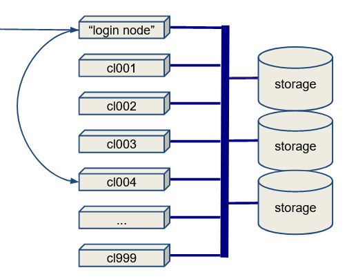

## Cluster storage
### Cluster Architecture

Here is the basic architecture of an HPC cluster:
- There is a login node (or maybe more than one).
- There might be a data transfer node (DTN), which is a login node specially designated for doing data transfers.
- There are a lot of compute nodes. The compute nodes may or may not have local disks.
- Most I/O goes to a storage array or SAN (Storage Array Network).

Broadly, you have two choices: You can do I/O to the node-local disk (if there is any), or you can do I/O to the SAN. Local disk suffers little or no contention but is inconvenient.

> ## Local disk
>
> What are the inconveniences of a local disk? What sort of work patterns suffer most from this? What suffers the least? That is, what sort of jobs can use local disk most easily?
{: .challenge}

Local disk performance depends on a lot of things. If you’re interested you can get an idea about Intel data center solid-state drives [here](https://www.intel.ca/content/www/ca/en/products/docs/memory-storage/solid-state-drives/data-center-ssds/dc-p4610-p4618-series-brief.html).

For that particular disk model, sequential read/write speed is 3200/3200 MB/sec, It is also capable of 654K/220K IOPS (IO operations per second) for 4K random read/write.

### Storage Array Network
Most input and output on a cluster goes through the SAN. There are many architectural choices made in constructing  SAN.
- What technology? [Lustre](http://lustre.org/about/) popular these days. ACENET & Compute Canada use it. [GPFS](https://www.ibm.com/support/knowledgecenter/en/STXKQY_4.2.0/com.ibm.spectrum.scale.v4r2.ins.doc/bl1ins_intro.htm) is another.
- How many servers, and how many disks in each? What disks?
- How many MDS? MDS = MetaData Server. Things like `ls` only require metadata. Exactly what is handled by the MDS (or even if there is one) may depend on the technology chosen (e.g. Lustre).
- What switches and how many of them?
- Are things wired together with fibre or with ethernet? What’s the wiring topology?
- Where is there redundancy or failovers, and how much?

This is all the domain of the sysadmins, but what should you as the user do about input/output?

### Programming input/output.
If you’re doing parallel computing you have choices about how you do input and output.

- One-file-per-process is reliable, portable and simple, but lousy for checkpointing and restarting.
- Many small files on a SAN (or anywhere, really) leads to metadata bottlenecks. Most HPC filesystems assume no more than 1,000 files per directory.
- To have many different processes write to the same file at one time is called
  "parallel I/O".  MPI supports this via a specification called MPI-IO.
- Parallel I/O makes restarts simpler, but must be written into the program.  
  It also requires support from the underlying file system.  (Luster and GPFS support it.)
- High-level interfaces like [NetCDF](https://www.unidata.ucar.edu/software/netcdf/docs/) and [HDF5](https://www.hdfgroup.org/solutions/hdf5/) are highly recommended
- I/O bottlenecks:
    - Disk read-write rate. Alleviated by striping.
    - Fibre bandwidth (or Ethernet or …)
    - Switch capacity.
    - Metadata accesses (especially if only one MDS)

> ## Measuring I/O rates
>
> - Look into [IOR](https://ior.readthedocs.io/en/latest/index.html)
> - Read this 2007 paper, [Using IOR to Analyze the I/O performance for HPC Platforms](https://cug.org/5-publications/proceedings_attendee_lists/2007CD/S07_Proceedings/pages/Authors/Shan/Shan_paper.pdf)
> - Neither of these are things to do right this minute!
{: .challenge}

The most important part you should know is that the parallel filesystem is optimized for storing large shared files that can be possibly accessible from many computing nodes. So, it shows very poor performance to store many small size files. As you may get told in our new user seminar, we strongly recommend users not to generate millions of small size files.

—-- Takeaways:

- I/O is complicated. If you want to know what performs best, you’ll have to experiment.
- A few large IO operations are better than many small ones.
- A few large files are usually better than many small files.
- High-level interfaces (e.g. HDF5) are your friends, but even they’re not perfect.

## Moving data on and off a cluster

- "Internet" cabling varies a lot. 100Mbit/s widespread, 1Gbit becoming common, 10Gbit or more between *most* CC sites
  - Remember, there are 8 bits in a byte.  Pay careful attention to whether the number you are reading is bits or bytes!
- CANARIE is the Canadian research network. Check out their [Network website](https://www.canarie.ca/network/)
- Firewalls sometimes the problem - security versus speed

- Filesystem at sending or receiving end often the bottleneck (SAN or simple disk)
- What are the typical disk I/O rates? See above! Highly variable!

> ## Estimating transfer times
> 1. How long to move a gigabyte at 100Mbit/s?
> 2. How long to move a terabyte at 1Gbit/s?
>
> > ## Solution
> > Remember a byte is 8 bits, a megabyte is 8 megabits, etc.
> > 1. 1024 MByte/GByte * 8 bit/Byte / 100 Mbit/sec = 81 sec
> > 2. 1024 TByte/GByte * 8 bit/Byte / 1 Gbit/sec = 8192 sec,
> >    a little under 2 hours and 20 minutes
> >
> > Remember these are "theoretical maximums"! There is almost always some other bottleneck or contention that reduces this!
> >
>  {: .solution}
{: .challenge}

- Restartable downloads (wget? rsync? Globus!)
- checksumming (md5sum) to verify the integrity of large transfers


