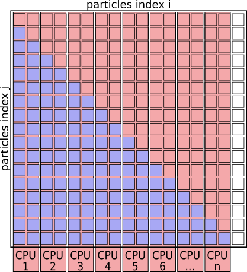

> ## Our Goals
> * Run as much as possible in parallel.
> * Keep all CPU-cores busy at all time.
> * Avoid processes/threads having to wait long for data.
{: .callout}


## What does that mean in terms of our MD algorithm?

### Serial Algorithm

The Serial MD algorithm written pseudo code looks somewhat like this:

#### Pseudo Code 
```python
initialize()
step = 0

while step < numSteps:

  for ( i = 1;  i <= nParticles; i++ ):
    for ( j = 1;  j <= nParticles; j++ ):
      if ( i != j ) :
        calculate_distance(i, j)
        calculate_potential_energy(i, j)
        # Attributing half of the total potential energy of this pair to particle J.

        calculate_force(i, j)
        # Add particle J's contribution to the force on particle I.

  calculate_kinetic_energy()
  update_velocities()
  update_coordinates()

finalize()
```
{: .code}

The algorithm basically works through a full matrix of size nParticles^2,
evaluating the distances, potential energies and forces for all pairs (i,j)
except for (i==j).

Graphically it looks like this:

#### Interaction Matrix: pair interactions (i!=j)


### Optimized Serial Algorithm

We don't need to evaluate the pairs of particles twice for (i,j) and (j,i),
as the contribution to the potential energy for both is always the same,
as is the magnitude of the force for this interaction, just the direction
will always point towards the other particle.

We can basically speed up the algorithm by a factor of 2 just by eliminating
redundant pairs and only evaluating pairs (i<j) or vice versa.

#### Pseudo Code 
```python
initialize()
step = 0

while step < numSteps:

  for ( i = 1;  i <= nParticles; i++ ):
    for ( j = 1;  j <= nParticles; j++ ):
      if ( i < j ):
        calculate_distance(i, j)
        calculate_potential_energy(i, j)
        # Attributing the full potential energy of this pair to particle J.

        calculate_force(i, j)
        # Add the force if pair (I,J) to both particles.

  calculate_kinetic_energy()
  update_velocities()
  update_coordinates()

finalize()
```
{: .code}

#### Interaction Matrix: pair interactions (i<j)


### Simplistic parallelization of the outer FOR loop

A simplistic parallelization scheme would be to turn the outer for-loop
(over index i) into a parallel loop. How this can be done will be covered
on days two and three of the workshop.

The work could be distributed by assigning `i=1,2` to CPU&nbsp;1, `i=3,4` to 
CPU&nbsp;2, and so on. 

#### Pseudo Code
```python
initialize()
step = 0

while step < numSteps:

  # Run this Loop in Parallel:
  for ( i = 1;  i <= nParticles; i++ ):

    for ( j = 1;  j <= nParticles; j++ ):
      if ( i < j ):
        calculate_distance(i, j)
        calculate_potential_energy(i, j)
        # Attributing the full potential energy of this pair to particle J.

        calculate_force(i, j)
        # Add the force if pair (I,J) to both particles.
  gather_forces_and_potential_energies()

  # Continue in Serial:
  calculate_kinetic_energy()
  update_velocities()
  update_coordinates()
  communicate_new_coordinates_and_velocities()

finalize()
```
{: .code}

#### Interaction Matrix: with simplistic parallelization


> 
> With this parallelization scheme CPU cores are idle ~50% of the time.
{: .error}

With this scheme CPU&nbsp;1 will be responsible for many more interactions
as CPU&nbsp;8.  This can easily approved upon by creating a pair-list upfront
and evenly distributing particle-pairs for evaluation across the CPUs.


#### Pseudo Code: Using pair-list
```python
initialize()
step = 0

while step < numSteps:

  # generate pair-list
  pair_list = []
  for ( i = 1;  i <= nParticles; i++ ):
    for ( j = 1;  j <= nParticles; j++ ):
      if ( i < j ):
        pair_list.append( (i,j) )

  # Run this Loop in Parallel:
  for (i, j) in pair_list:
    calculate_distance(i, j)
    calculate_potential_energy(i, j)
    # Attributing the full potential energy of this pair to particle J.

    calculate_force(i, j)
    # Add the force if pair (I,J) to both particles.
  gather_forces_and_potential_energies()

  # Continue in Serial:
  calculate_kinetic_energy()
  update_velocities()
  update_coordinates()
  communicate_new_coordinates_and_velocities()

finalize()
```
{: .code}

### Using cut-offs

Still this MD algorithm scales with N<sup>2</sup><sub>particles</sub>.
Applying an appropriate cut-off radius r<sub>cut-off</sub>, beyond which all
forces and potential-energy contributions are truncated and treated as zero,
can restore near linear scaling.  One way to do this, is to bail out of
the loop over the pair-list after computing the distance if it is larger
than r<sub>cut-off</sub>.

Further optimizations can be made by avoiding to compute the distances for
all pairs at every step - essentially by keeping neighbor lists and using
the fact that particles travel only small distances during a certain number
of steps, however those are beyond the scope of this lesson and are well
described in text-books, journal publications and technical manuals.


### Spatial- (or Domain-) Decomposition

When simulating large numbers of particles (~ 10<sup>5</sup>)) and across many nodes, 
communicating the updated coordinates, forces, etc. every timestep can 
become a bottle-neck when using this Force- (or Particle-) Decomposition 
scheme, where particles are assigned to fixed processors as above.

To reduce the amount of communication between processors and nodes, we can
partition the simulation box along it's axes into smaller domains.
The particles are then assigned to the processors depending in which domain
they are currently located.  This way many pair-interactions will be local
within the same domain and therefore handled by the same processor.  For 
pairs of particles that are not located in the same domain, we can use e.g.
the "eighth shell" method in which a processor handles those pairs, in which 
the second particle is located only in positive direction of the dimensions,
as illustrated below.


#### Domain Decomposition using Eight-Shell method


In this way each domain only needs to communicate with neighboring domains
in one direction as long as none of the domain's dimension shorter than the
longest cut-off.


> Domain Decomposition not only applies to Molecular Dynamics (MD) but also 
> to Computational Fluid Dynamics (CFD), Finite Elements methods, Climate- 
> &amp; Weather simulations and many more.
{: .callout }


### MD Literature:

1. Larsson P, Hess B, Lindahl E.; 
   Algorithm improvements for molecular dynamics simulations.<br>
   Wiley Interdisciplinary Reviews: Computational Molecular Science 2011;
   1: 93–108.   [doi:10.1002/wcms.3](http://dx.doi.org/10.1002/wcms.3)
2. Allen MP, Tildesley DJ;
   Computer Simulation of Liquids. Second Edition. 
   Oxford University Press; 2017. 
3. Frenkel D, Smit B; 
   Understanding Molecular Simulation: From Algorithms to Applications. 
   2nd Edition. Academic Press; 2001. 


## Load Distribution

Generally speaking the goal is to distribute the work across the available
resources (processors) as evenly as possible, as this will result in the 
shortest amount of time and avoids some resources being left unused.

#### Ideal Load: all tasks have same size
An ideal load distribution might look like this:


---

#### Unbalanced Load: size of tasks differs
Whereas if the tasks that are distributed have varying length, the program
needs to wait for the slowest task to finish.  Such situations are even worse
in cases where a parallel execution is followed by a synchronization step,
before proceeding to the next iteration of a larger-scope loop (e.g. next 
time-step, generation).


---

#### Balanced Load: pairing long and short tasks
In cases where the length of independent tasks can reasonably well be
estimated, tasks of different lengths can be combined to "chunks" of similar
length.


---

#### Larger Chunk-size evens out size of tasks
Chunks consisting of many tasks (large chunk-size) can result relatively 
consistent lengths of the chunks, even if the lengths of the tasks are not
pre-determined and have large variations.  However this can lead to 
situations, where a large fraction of the processors is left unused, when
by chance a chunk consists of many very long tasks, or as in the figure
below, the number of chunks is sightly larger than the closest multiple of 
the processors.


---

#### Smaller Chunk-size can sometimes behave better
Smaller chunk-sizes (and therefore more chunks) are better in avoiding
waste of resources during the last step, however are inferior in averaging
out the different lengths of tasks.


### Task-queues

Creating a queue (list) of independent tasks which are processed asynchronously 
can improve the utilization of resources especially if the tasks are sorted
from the longest to the shortest.

However special care needs to be taken to avoid race-conditions, where two 
processes take the same task from the stack.  Having a dedicated manager-
process to assign the work to the compute processes introduces overhead
and can become a bottle-neck when very large number of compute processes are
involved.

This also increases the amount of communication needed.
